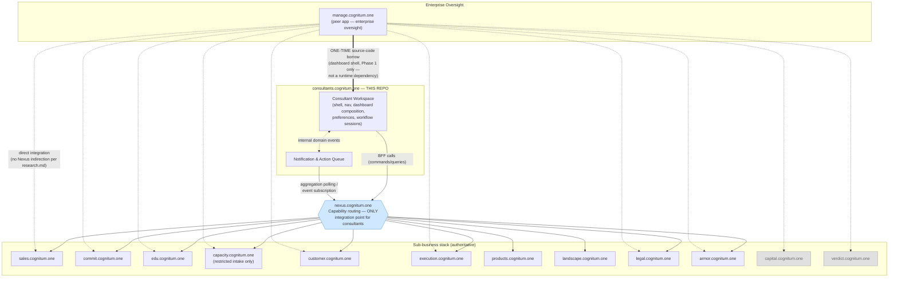

# Bounded Context Map — consultants.cognitum.one

Source of truth: `.plans/research.md`. This document maps every bounded context this repo touches and the
relationship type between this repo's context(s) and each of them. It does not model the internals of any
external context — only the boundary this repo sees.

## 1. Contexts in play

| # | Context | Owning service | Owned by this repo? |
|---|---|---|---|
| 1 | **Consultant Workspace** | `consultants.cognitum.one` (this repo) | Yes |
| 2 | **Notification & Action Queue** | `consultants.cognitum.one` (this repo) | Yes |
| 3 | Capability Routing | `nexus.cognitum.one` | No — integration infrastructure, not a business context |
| 4 | Sales | `sales.cognitum.one` | No |
| 5 | Proposals & Commitments | `commit.cognitum.one` | No |
| 6 | Education | `edu.cognitum.one` | No |
| 7 | Capacity & Expertise | `capacity.cognitum.one` | No |
| 8 | Customer Records | `customer.cognitum.one` | No |
| 9 | Engagement Delivery | `execution.cognitum.one` | No |
| 10 | Products & Services | `products.cognitum.one` | No |
| 11 | Market/Competitive Intelligence | `landscape.cognitum.one` | No |
| 12 | Legal | `legal.cognitum.one` | No |
| 13 | Security & Access | `armor.cognitum.one` | No |
| 14 | Financial Oversight | `capital.cognitum.one` | No — **not consumed by this repo** |
| 15 | Enterprise Decision Oversight | `verdict.cognitum.one` | No — **not consumed by this repo** |
| 16 | Enterprise Oversight | `manage.cognitum.one` | No — peer application, not a runtime dependency |

Contexts 1–2 are detailed in `consultant-experience-context.md`. Contexts 4–13 each get an ACL adapter in
`anti-corruption-layers.md`. Contexts 14–15 (Capital, Verdict) are explicitly **excluded** — per
`research.md`'s "Manage Consultants Section" and the implementation plan's integration model, these are
consumed only by `manage.cognitum.one` and never appear in this repo's Nexus routing table. Context 16
(Manage) is a peer, not a dependency, with one narrow exception noted in §3.

## 2. Relationship types

DDD context-mapping vocabulary: Partnership, Shared Kernel, Customer/Supplier, Conformist, Anticorruption
Layer (ACL), Open-Host Service (OHS), Published Language (PL), Separate Ways.

| Context | Relationship (from consultants' POV) | Why |
|---|---|---|
| **nexus.cognitum.one** | **Open-Host Service + Published Language**, consumed through this repo's own **ACL** (the `nexus-client` crate) | `research.md` states Nexus "owns... API normalization" and is "the only integration point" — a textbook OHS/PL. This repo still wraps Nexus responses in its own ACL rather than trusting Nexus's normalized shape verbatim, because Nexus's job is *cross-service* normalization, not normalization into *this repo's* aggregate/view-model vocabulary. |
| **Sales** (`sales.cognitum.one`) | **Customer/Supplier**, downstream — **Conformist on business-rule decisions** (e.g. lead-conflict policy), protected by an ACL | Sales "determines ownership and conflict status"; research.md is explicit that "the Consultants frontend must not independently decide" this policy. Consultants is a customer of Sales' capability but conforms entirely to its verdicts. |
| **Commit** (`commit.cognitum.one`) | **Customer/Supplier**, downstream | "Consultants create and manage proposals centrally, but Commit remains authoritative" — consultants directs real usage traffic at Commit's proposal workflow and expects it to serve that need, but does not own the outcome. |
| **Edu** (`edu.cognitum.one`) | **Customer/Supplier**, leaning **Conformist** (read-heavy, published catalog) | Consultants renders "the education experience" but the catalog/completion model is fully Edu's; little negotiation surface implied. |
| **Capacity** (`capacity.cognitum.one`) | **Conformist**, via a deliberately **restricted ACL** | research.md is explicit: "Consultants must not receive internal Capacity access" and the portal exposes only "a restricted consultant profile form." This is the narrowest, most gated relationship of the ten. |
| **Customer** (`customer.cognitum.one`) | **Customer/Supplier**, permission-filtered | "The consultants portal displays only assigned or permitted customer information" — consultants consumes a subset shaped by its own access, not a raw feed. |
| **Execution** (`execution.cognitum.one`) | **Customer/Supplier** | Consultants gets "the consultant's assigned delivery workspace" — a real, ongoing dependency on Execution's data shape and status model. |
| **Products** (`products.cognitum.one`) | **Conformist** (published catalog, effectively OHS/PL for product data) | "Consultants receive approved product information" — one-directional, no negotiation implied. |
| **Landscape** (`landscape.cognitum.one`) | **Customer/Supplier**, mostly Conformist, with a narrow upstream contribution channel | Consultants "consume[s] approved intelligence and may submit field observations" — a small write path back into Landscape, but Landscape still governs what counts as "approved." |
| **Legal** (`legal.cognitum.one`) | **Conformist** (pure consumer of published, approved content) | "Commit and Consultants consume approved legal capabilities without transferring legal ownership to either application" — no influence over Legal's model. |
| **Armor** (`armor.cognitum.one`) | **Conformist**, infrastructural (not a UI-facing capability) | "Consultants do not need a general Armor interface... Armor operates beneath the consultant experience." Consumed only indirectly, for permission assertions that drive permission-aware presentation. |
| **manage.cognitum.one** | **Separate Ways** at runtime, with one explicit, one-time exception | Implementation plan: "peer application, not a dependency." The sole exception is a one-time, one-directional **source-code asset borrow** (copying manage's dashboard shell/components in Phase 1) — a codebase-level act, not an ongoing bounded-context relationship, and it stops being relevant once Phase 5 (design-system extraction) gives both apps a shared package instead. |
| **capital.cognitum.one**, **verdict.cognitum.one** | **No relationship** | Not reachable from this repo per research.md's integration model; owned exclusively by `manage.cognitum.one`. Listed here only to make the exclusion explicit and prevent future scope creep. |

**Assumption (flagged):** research.md doesn't use formal DDD terms, so the labels above are inferred from
the *direction of authority* and *degree of negotiation* each section implies (e.g. "X owns / X determines /
consultants must not decide" → Conformist; "consultants provides the experience for" → Customer/Supplier).
Where a service exposes primarily a stable, one-directional read surface (Products, Legal), it's classed as
Conformist rather than Customer/Supplier even though no explicit governance forum is described.

## 3. Context diagram

Key reading notes:
- Solid arrows from `consultants.cognitum.one` all terminate at Nexus — never at a sub-business service directly. This is a hard rule from research.md, not a convenience.
- Dashed arrows from `manage.cognitum.one` go straight to the sub-business stack, including Capital and Verdict (greyed out) — those two never appear on the consultants side of the diagram.
- The double-line arrow (Manage → Consultant Workspace) is the single sanctioned code-asset exception and is explicitly *not* a bounded-context relationship (no runtime traffic, no shared data).
